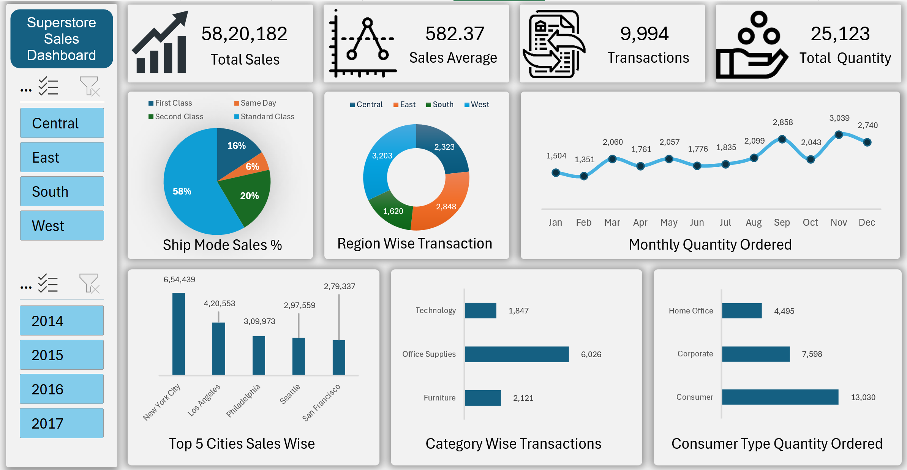
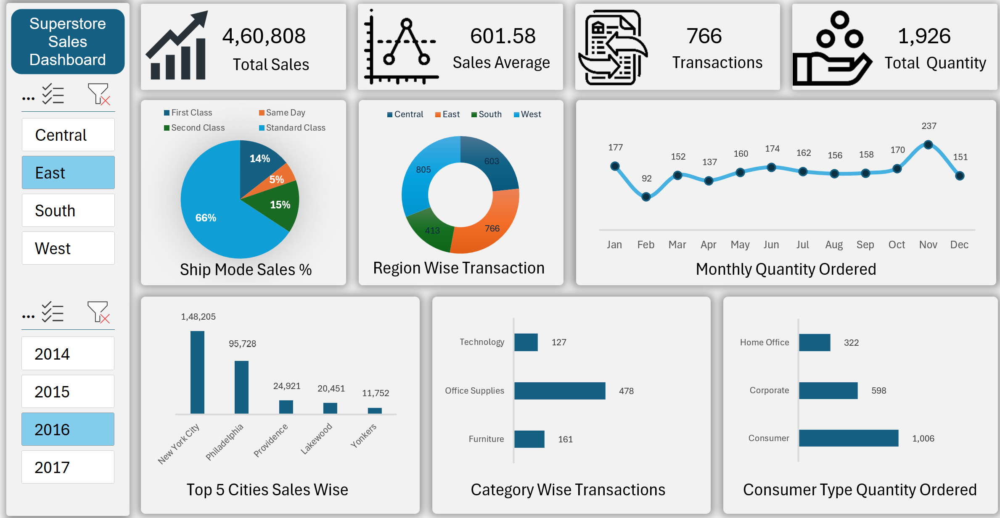

# 📊 Excel Sales Dashboard

An interactive **Sales Dashboard** built in **Microsoft Excel** using **Pivot Tables, Pivot Charts, KPIs, and Slicers** to analyze sales performance across different regions, categories, and customer segments.

---

## 🚀 Features

- 📈 Total Sales KPI
- 📊 Sales Average
- 📦 Total Transactions
- 👥 Total Quantity Sold
- 🌍 Region-wise Analysis
- 📅 Year-wise Filtering
- 🚚 Ship Mode Analysis
- 🏙️ Top 5 Cities by Sales
- 📂 Category-wise Analysis
- 👤 Consumer Segment Analysis

---

## 🖼️ Dashboard Preview

### Dashboard with Filters Applied

---

## 🎥 Dashboard Demo

Click the image below to download and watch the demo video.

---

## 🛠️ Tools Used

- Microsoft Excel
- Pivot Tables
- Pivot Charts
- Slicers
---

## 📁 Project Files

- `sales-dashboard.xlsx` – Interactive Dashboard
- `superstore-data.xlsx` – Raw Dataset
- `dashboard-overview.png` – Dashboard Preview
- `dashboard-filtered.png` – Filtered Dashboard
- `dashboard-demo.mp4` – Dashboard Demo

---
